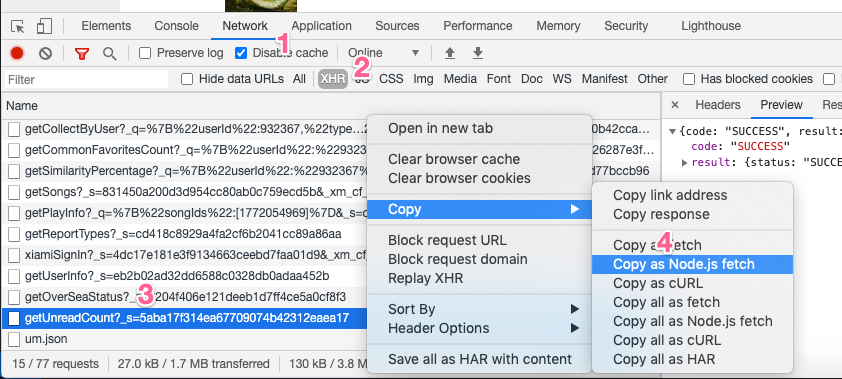

# Xiami Exporter

导出虾米音乐的个人数据，功能：
- 导出收藏歌曲为 json
- 导出收藏艺人为 json
- 导出收藏专辑为 json
- 下载已导出歌曲的 MP3 文件
- 下载已导出的歌曲、专辑、艺人的封面图片

## Instruction

1. Clone 项目，创建 Python 3 虚拟环境，安装所有依赖
2. 在 Chrome 中登录虾米，点击 “我的音乐”，从 URL 中获取 user_id，例如 `https://www.xiami.com/user/932367`, user_id 即为 `932367`.
3. 运行 `python cli.py init`，根据提示，输入配置项，其中包括刚刚获取的 user_id.
4. 回到 Chrome “我的音乐” 页面，右键选择 “审查页面” (Inspect)，点击 “网络” (Network) 并在过滤器中选择 XHR，刷新页面，在最后一条带有 `_s` 的网络请求上点击右键，选择 “Copy - Copy as Node.js fetch”
  
5. 在项目目录下创建 fetch.py 文件，将刚才拷贝的内容粘贴进去并保存
6. 运行 `python cli.py check`, 显示成功表示可以使用导出功能，否则请重试上一步，或联系开发者
7. 根据想要导出的数据，运行相应指令，如 `python cli.py export-fav-songs` 即导出收藏歌曲为 json

## Development

hierarchy
```
XiamiExports/
  db.sqlite3
  json/
    songs/
    albums/
    playlists/
    artists/
  music/
    XXXX_SONG_ID.mp3
  covers/
    XXXX_ALBUM_ID.jpg
```

my TODO
- [ ] download mp3 (getPlayInfo)
- [ ] add id3 for mp3 based on songs json
- [ ] download album cover
- [ ] remove useless keys in json
- [ ] create csv for songs

features
- [ ] export fav albums
- [ ] export playlists (both personal and fav)
- [ ] export artists
